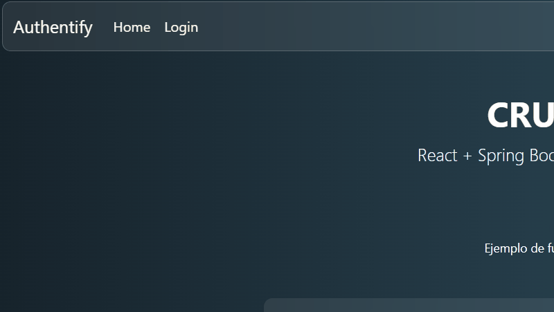

# 📌 CRUD de Usuarios con React y JWT

Aplicación frontend desarrollada con **React** que consume una API REST protegida con JWT. Permite a un usuario autenticado realizar operaciones CRUD (Crear, Leer, Actualizar y Eliminar) sobre una lista de usuarios.

## 🚀 Características

- Inicio de sesión con **JWT**
- Visualización de todos los usuarios
- Creación de nuevos usuarios
- Edición y eliminación de usuarios existentes
- Estilos con **Bootstrap 5**
- Componentes reutilizables
- Protección de rutas privadas

## 🛠 Tecnologías utilizadas

- **React** 19
- **React Router DOM**
- **Bootstrap 5**
- **Fetch API** para consumir la API REST
- **JWT** para autenticación segura

## 📂 Estructura del proyecto

```Estructura
frontend/
│── public/
│   ├── index.html
│   ├── assets/ (imagenes/gifs)
│
│── src/
│   ├── api/           # Funciones para llamadas a la API
│   ├── components/    # Componentes reutilizables
│   ├── context/       # Contexto global para autenticación
│   ├── pages/         # Páginas del sitio
│   ├── App.jsx
│   ├── index.js
│   ├── App.css
│
│── package.json
│── README.md
```

## ⚙️ Instalación

### Clonar el repositorio

```bash
git clone https://github.com/tuusuario/frontend-crud.git
```

### Entrar en el directorio

```bash
cd frontend-crud
```

### Instalar dependencias

```bash
npm install
```

## ▶️ Ejecución en desarrollo

```bash
npm run dev
```

Se abrirá en [http://localhost:3000](http://localhost:3000)

## 🔧 Variables de entorno

Crea un archivo `.env` en la raíz del proyecto con:

```env
REACT_APP_API_URL=http://localhost:8080/api
```

## 📸 Captura de pantalla



## 📜 Licencia

MIT License
